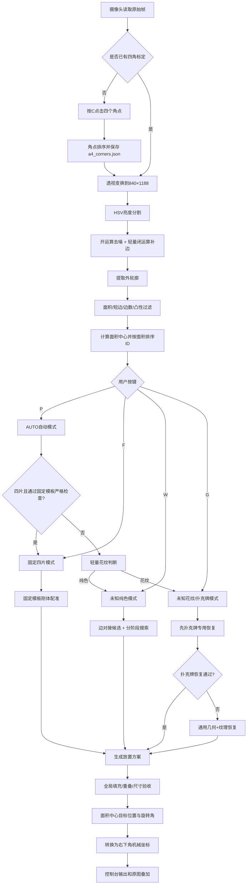

# `main.zip` 拼图识别与矩形恢复算法、流程逻辑详细说明

> 本说明依据压缩包中当前的 `main.py`、`puzzle_vision/solver.py`、`puzzle_vision/geometry.py`、`puzzle_vision/card_recognition.py` 和 `puzzle_vision/config.py` 编写。  
> 说明重点是当前实时优化版本：保留 `pick_base` 的识别方式，支持固定四片、未知纯色、未知花纹/扑克牌三类矩形恢复，并使用后台线程避免求解时画面卡死。

---

## 1. 系统要完成的任务

程序从摄像头画面中完成以下工作：

1. 标定A4纸或标定方框的四个角点。
2. 将倾斜、透视变形的标定区域校正为固定的 `840 × 1188` 图像。
3. 从黑色背景中分割亮色碎片。
4. 提取每片碎片的轮廓、面积、多边形顶点和面积中心。
5. 根据按键选择恢复模式：
   - 固定四片模板恢复；
   - 未知纯色碎片自主恢复；
   - 未知花纹或扑克牌碎片恢复；
   - 自动判断模式。
6. 只通过**旋转和平移**把所有碎片组合成矩形，不允许缩放，不允许单片镜像。
7. 输出每片碎片的：
   - ID；
   - 初始面积中心；
   - 目标面积中心；
   - 旋转角度。
8. 将恢复后的目标轮廓和目标面积中心反投影到原始相机画面。
9. 求解在后台线程执行，摄像头画面保持刷新，不再出现长时间假死。

---

## 2. 工程模块与职责

当前压缩包中主要文件的职责如下。

| 文件 | 主要职责 |
|---|---|
| `main.py` | 摄像头读取、四角标定、透视校正、碎片识别、模式调度、异步求解、坐标输出、画面绘制 |
| `puzzle_vision/solver.py` | 固定模板匹配、扑克牌专用恢复、未知碎片边匹配搜索、候选评分、最终验收 |
| `puzzle_vision/geometry.py` | 多边形面积、质心、刚体变换、SVD配准、边对接、重叠面积、最小外接矩形 |
| `puzzle_vision/card_recognition.py` | 扑克牌圆角、点数/字母、花纹可见性识别 |
| `puzzle_vision/config.py` | 默认参数、固定四片模板顶点、求解器阈值 |
| `a4_corners.json` | 保存手动标定得到的四个角点 |
| `taught_layout.json` | 旧版或扩展版示教布局数据；当前 `main.py` 的自主恢复会主动关闭示教布局 |
| `config.json` | 一份求解配置文件，但当前根目录 `main.py` 并不会自动读取这个文件 |

### 2.1 配置文件需要注意的地方

当前 `main.py` 查找的是：

```python
puzzle_solver_config.json
```

并且要求该文件和 `main.py` 位于同一目录。

如果该文件不存在，程序会直接使用 `puzzle_vision/config.py` 中的 `DEFAULT_CONFIG`。压缩包中的：

```text
pick_rdk_solver_complete/config.json
```

不会被根目录的 `main.py` 自动读取。

因此，现场调参数时有两种方式：

1. 直接修改 `puzzle_vision/config.py` 中的默认参数；
2. 将需要覆盖的配置保存为 `main.py` 同目录下的 `puzzle_solver_config.json`。

---

## 3. 系统总体流程



---

# 第一部分：视觉识别流程

## 4. 摄像头主循环

入口函数是：

```python
main()
```

程序打开：

```python
cv2.VideoCapture(CAMERA_INDEX)
```

当前摄像头索引为：

```python
CAMERA_INDEX = 0
```

程序还设置：

```python
camera.set(cv2.CAP_PROP_BUFFERSIZE, 1)
```

目的不是提高算法速度，而是尽量减小摄像头内部缓存。处理负载较高时，程序更容易拿到最新画面，而不是连续显示几帧之前的旧画面。

主循环每次执行：

1. 检查后台求解线程是否返回结果；
2. 读取一帧相机画面；
3. 根据时间间隔决定是否重新做一次完整识别；
4. 绘制当前碎片；
5. 绘制已有目标恢复方案；
6. 求解中则显示 `SOLVING`；
7. 读取键盘按键。

---

## 5. 四角标定

### 5.1 标定触发

按下 `C` 后，程序进入：

```python
select_calibration_corners(frame)
```

用户在原始画面中点击四个角点，点击顺序不限。

操作：

- 鼠标左键：添加角点；
- `R`：清空重新选择；
- `Enter`：确认；
- `ESC`：取消。

### 5.2 四点自动排序

函数：

```python
order_corners(points)
```

将四个点排列为：

1. 左上；
2. 右上；
3. 右下；
4. 左下。

排序使用坐标和、坐标差：

- `x + y` 最小：左上；
- `x + y` 最大：右下；
- `y - x` 最小：右上；
- `y - x` 最大：左下。

排序后的四个角点会保存到：

```text
a4_corners.json
```

下次启动会通过：

```python
load_corners()
```

自动读取，不需要每次重新点击。

---

## 6. 透视校正

### 6.1 标准平面

程序把标定四边形映射为：

```text
宽  = 840 px
高  = 1188 px
```

标准目标角点为：

```text
左上：(0, 0)
右上：(839, 0)
右下：(839, 1187)
左下：(0, 1187)
```

调用：

```python
cv2.getPerspectiveTransform()
```

得到两个矩阵：

```text
camera_to_warp：原始相机画面 → 标定平面
warp_to_camera：标定平面 → 原始相机画面
```

### 6.2 为什么是840×1188

A4尺寸为：

```text
210 mm × 297 mm
```

所以：

```text
840 / 210 = 4 px/mm
1188 / 297 = 4 px/mm
```

因此校正后比例固定为：

```text
4 px/mm
```

这使得求解器可以直接将像素坐标除以4转换为毫米坐标，不会受到相机远近变化的影响。

### 6.3 矩阵缓存

透视矩阵只在以下情况重新计算：

- 程序刚启动并成功读取旧标定；
- 用户按 `C` 重新标定。

正常每一帧不会重复执行 `getPerspectiveTransform()`，从而减少无意义计算。

---

## 7. 碎片二值分割

入口函数：

```python
create_piece_mask(calibrated_region)
```

### 7.1 HSV亮度通道

程序将校正图转换为HSV：

```python
hsv = cv2.cvtColor(image, cv2.COLOR_BGR2HSV)
value_channel = hsv[:, :, 2]
```

使用V通道而不是直接使用灰度，主要目的是：

- 白色碎片亮；
- 彩色碎片通常也比黑色背景亮；
- 对不同色相的兼容性比固定RGB阈值更好。

### 7.2 高斯滤波

```python
cv2.GaussianBlur(value_channel, (5, 5), 0)
```

作用：

- 降低传感器噪声；
- 减少纸面纹理产生的小孔；
- 让Otsu阈值更稳定。

### 7.3 Otsu自动阈值

```python
cv2.threshold(
    blurred,
    0,
    255,
    cv2.THRESH_BINARY + cv2.THRESH_OTSU
)
```

Otsu根据亮度直方图自动选择黑色背景和亮色碎片之间的分割阈值。

如果Otsu得到的阈值小于30，说明画面过暗或背景噪声影响较大，程序强制改用：

```python
threshold = 30
```

避免把大片黑背景噪声当成碎片。

### 7.4 形态学开运算

使用：

```text
3×3 椭圆核
迭代1次
```

开运算为：

```text
腐蚀 → 膨胀
```

作用是去除孤立亮点和很小的反光噪声。

### 7.5 轻量闭运算

使用：

```text
5×5 椭圆核
迭代1次
```

闭运算为：

```text
膨胀 → 腐蚀
```

作用是补上碎片边缘的小缺口。

这里故意没有继续使用更强的 `7×7、2次` 闭运算，因为强闭运算会把距离较近的两片纸连接成同一个白色区域，导致：

- 原来4片被识别成2～3片；
- 求解器收到错误数量；
- 后续无论算法多好都无法正确恢复。

---

## 8. 轮廓提取与碎片过滤

程序使用：

```python
cv2.findContours(
    mask,
    cv2.RETR_EXTERNAL,
    cv2.CHAIN_APPROX_SIMPLE
)
```

只提取外轮廓，不处理内部孔洞轮廓。

每个候选轮廓经过以下过滤。

### 8.1 面积过滤

当前高级题识别范围由毫米面积换算：

```text
最小面积：100 mm² × 4² = 1600 px²
最大面积：6500 mm² × 4² = 104000 px²
```

即：

```python
MIN_PIECE_AREA_PX = 1600
MAX_PIECE_AREA_PX = 104000
```

面积过小的轮廓通常是：

- 噪点；
- 字符；
- 强反光；
- 阴影中的亮斑。

面积过大的轮廓通常是：

- 背景分割错误；
- 多片粘连；
- 标定区域本身被识别。

### 8.2 最小短边过滤

对轮廓计算旋转外接矩形：

```python
cv2.minAreaRect(contour)
```

取矩形短边：

```python
short_side = min(width, height)
```

要求：

```text
short_side ≥ 24 px
```

用于过滤：

- 细长分界线；
- 纸边反光；
- 电线；
- 狭长噪声。

---

## 9. 多边形拟合

入口：

```python
approximate_straight_polygon(contour)
```

### 9.1 先计算凸包

```python
hull = cv2.convexHull(contour)
```

目的：

- 消除纸边锯齿；
- 消除小凹坑；
- 减少阴影造成的局部凹陷；
- 将轮廓变成适合直边拼接的几何轮廓。

### 9.2 多组拟合精度

程序不是只用一个 `epsilon`，而是依次尝试：

```text
0.015
0.010
0.012
0.018
0.020
0.025
0.030
0.040
```

每个值都乘以凸包周长，再调用：

```python
cv2.approxPolyDP()
```

拟合候选必须满足：

1. 边数为3～5；
2. 多边形为凸多边形；
3. 面积与原凸包面积尽量接近。

### 9.3 候选选择

定义面积相对误差：

```text
面积误差 = |凸包面积 - 拟合多边形面积| / 凸包面积
```

最终选择面积误差最小的拟合结果。

该策略比固定 `epsilon` 更稳定：

- 轮廓清晰时，小epsilon保留角点；
- 边缘较糊时，大epsilon可去除伪角点；
- 不会因为一个固定参数导致某一类碎片总是多出一条边或丢一条边。

---

## 10. 面积中心计算

程序统一使用碎片的**面积中心**，不再使用“最大内接安全点”。

入口：

```python
calculate_area_center(contour)
```

OpenCV轮廓矩为：

```text
M00：轮廓面积
M10：x方向一阶矩
M01：y方向一阶矩
```

面积中心在内部图像坐标中为：

```text
u_center = M10 / M00
v_center = M01 / M00
```

代码中进行四舍五入得到整数像素。

这个面积中心同时用于：

- 识别结果中心点；
- 初始吸取位置；
- 目标放置位置；
- 刚体变换的跟踪点。

因此输出中的“初始位置”和“目标位置”具有统一物理含义。

---

## 11. ID分配逻辑

所有有效碎片按以下关键字排序：

```text
1. 面积从小到大；
2. 面积相同时按内部图像y；
3. 再按内部图像x。
```

排序后依次编号：

```text
ID=1, ID=2, ID=3, ...
```

这意味着ID主要由面积决定。

需要注意：如果两块面积极其接近，并且识别轮廓在不同帧略有抖动，ID理论上仍可能交换。当前代码没有实现跨帧目标跟踪或匈牙利匹配，只是对当前帧重新排序。

---

# 第二部分：坐标系统

## 12. 程序中存在四套坐标

### 12.1 原始相机坐标

记为：

```text
(Xcamera, Ycamera)
```

特点：

- 原点在相机画面左上角；
- 向右为正；
- 向下为正；
- 受透视影响；
- 仅用于显示和点击标定。

### 12.2 校正图像坐标

记为：

```text
(u, v)
```

特点：

- 原点在校正区域左上角；
- `u` 向右；
- `v` 向下；
- 范围：
  - `u = 0～839`
  - `v = 0～1187`

识别、轮廓提取和OpenCV绘图都使用这套坐标。

### 12.3 求解器毫米坐标

记为：

```text
(xmm, ymm)
```

方向仍与校正图像相同：

- 左上角原点；
- 第一个坐标向右；
- 第二个坐标向下；
- 范围约为：
  - `0～210 mm`
  - `0～297 mm`

转换关系：

```text
xmm = u / 4
ymm = v / 4
```

求解器内部在这套坐标中做：

- 边长计算；
- 旋转和平移；
- 重叠面积；
- 矩形尺寸；
- 目标区域放置。

### 12.4 最终机械输出坐标

用户要求的输出坐标为：

- 原点：标定方框右下角；
- x轴：向上为正；
- y轴：向左为正。

校正图像点 `(u, v)` 转换为：

```text
x_output = 1187 - v
y_output = 839 - u
```

范围为：

```text
x_output = 0～1187
y_output = 0～839
```

四个角对应：

| 标定区域位置 | 输出坐标 |
|---|---|
| 右下角 | `(0, 0)` |
| 右上角 | `(1187, 0)` |
| 左下角 | `(0, 839)` |
| 左上角 | `(1187, 839)` |

### 12.5 求解器毫米坐标转机械像素坐标

求解器点 `(xmm, ymm)` 首先转换成校正图像像素：

```text
u = xmm × 4
v = ymm × 4
```

再转换为机械坐标：

```text
x_output = 1187 - ymm × 4
y_output = 839 - xmm × 4
```

代码对应：

```python
solver_mm_to_output_px()
```

---

## 13. 旋转角符号

`geometry.py` 使用行向量变换：

```text
P' = P · R + t
```

在图像坐标中：

- 向右为第一轴；
- 向下为第二轴；
- 正角度表现为顺时针旋转。

当前输出规则正好符合用户要求：

```text
顺时针：正值
逆时针：负值
```

例如：

```text
+90°：顺时针旋转90°
-90°：逆时针旋转90°
0°：不旋转
```

角度通过：

```python
wrap_angle_deg()
```

统一限制在：

```text
[-180°, 180°)
```

---

# 第三部分：识别结果转求解器数据

## 14. `PieceObservation`数据

函数：

```python
pieces_to_observations()
```

把 `DetectedPiece` 转换为求解器使用的 `PieceObservation`。

每片包含：

```text
id
polygon_mm
contour_px
centroid_mm
pickup_mm
area_mm2
perimeter_mm
edge_lengths_mm
```

### 14.1 多边形像素转毫米

```text
polygon_mm = polygon_px / 4
```

### 14.2 顶点方向归一化

调用：

```python
normalize_winding(polygon_mm, positive=True)
```

确保所有多边形顶点具有一致绕序。

如果不同碎片有的顺时针、有的逆时针，边方向、法向和边匹配逻辑会变得不一致，因此进入求解器前必须统一。

### 14.3 面积中心与吸取点统一

当前代码明确设置：

```python
centroid_mm = 图像矩面积中心 / 4
pickup_mm = centroid_mm.copy()
```

以前部分版本使用 `safe_interior_point()` 找远离边缘的安全点，那个点不一定是面积中心。

当前版本已经统一：

```text
识别中心 = 初始位置 = pickup_mm = 碎片面积中心
```

目标位置则是同一个面积中心经过最终刚体变换后的坐标。

---

## 15. 刚体变换模型

所有碎片的运动模型为：

```text
Ptarget = Psource · R + t
```

其中：

- `R`：2×2旋转矩阵；
- `t`：二维平移向量；
- 不包含缩放；
- 不包含透视变换；
- 不包含镜像。

合法旋转必须满足：

```text
RᵀR = I
det(R) = +1
```

函数：

```python
is_proper_rotation()
```

会验证矩阵是否为真正的二维旋转。

如果：

```text
det(R) = -1
```

则说明使用了反射或镜像，程序会拒绝该方案。

---

# 第四部分：目标区域选择

## 16. 判断碎片位于A4上半还是下半

函数：

```python
infer_source_region(pieces)
```

计算所有碎片内部图像纵坐标的平均值：

```text
mean_v = 所有面积中心v的平均值
```

判断：

```text
mean_v < 594  → 碎片主要位于上半区
mean_v ≥ 594  → 碎片主要位于下半区
```

### 16.1 对侧放置原则

如果碎片在上半区，则目标矩形放到下半区。

如果碎片在下半区，则目标矩形放到上半区。

未知碎片目标区域：

```text
源在上半：
target_zone_mm = [0, 148.5, 210, 297]

源在下半：
target_zone_mm = [0, 0, 210, 148.5]
```

数组表示：

```text
[x_min, y_min, x_max, y_max]
```

方向仍是求解器左上角毫米坐标。

---

# 第五部分：模式调度逻辑

## 17. 按键模式

| 按键 | 模式 | 调用入口 |
|---|---|---|
| `P` | AUTO自动判断 | `reconstruct_rectangle(..., "auto")` |
| `F` | 固定四片 | `solve_fixed_reconstruction()` |
| `W` | 未知纯色 | `solve_white_reconstruction()` |
| `G` | 花纹/扑克牌 | `solve_pattern_reconstruction()` |

支持的碎片数量为：

```text
1～4片
```

固定四片模式必须正好识别到4片。

扑克牌专用模式要求2～4片；如果只有1片，花纹模式会跳过扑克牌专用恢复，进入通用纹理恢复。

---

## 18. AUTO模式流程

AUTO模式不是把所有算法全部跑一遍，而是尽量只运行最可能的一条求解链。

### 18.1 第一步：固定四片严格检查

如果当前正好有4片，先尝试固定模板恢复。

AUTO接受固定模板必须同时满足：

```text
最大轮廓匹配误差 ≤ 8 mm
总碎片面积 / 固定矩形面积 ∈ [0.88, 1.12]
模板分配总代价 ≤ 20
```

如果满足，直接返回固定四片结果。

如果不满足，记录失败原因，但不会误把普通四片强行套到固定模板。

### 18.2 第二步：轻量花纹判断

固定模板不通过后，执行：

```python
estimate_pattern_information()
```

它不会在AUTO阶段做完整扑克牌字符识别，只进行快速统计。

每片碎片内部先腐蚀，避开：

- 黑色切边；
- 阴影；
- 轮廓锯齿。

然后计算：

```text
内部灰度标准差 std_gray
内部Canny边缘比例 edge_ratio
```

花纹可见条件：

```text
std_gray ≥ 15
或
edge_ratio ≥ 0.010
```

只要至少一片满足，即判定为花纹模式。

### 18.3 第三步：只运行首选算法

```text
判定为纯色 → 只运行纯色求解
判定为花纹 → 只运行花纹求解
```

当前：

```python
AUTO_TRY_OPPOSITE_FALLBACK = False
```

因此首选模式失败后，不会立刻再跑相反模式。

这样做是为了避免：

```text
固定算法失败
→ 扑克牌算法搜索
→ 通用花纹算法搜索
→ 纯色算法再搜索
```

导致用户感觉按一次P后卡很久。

如果AUTO判断错误，程序会提示：

- 按 `W` 强制纯色；
- 或按 `G` 强制花纹。

---

# 第六部分：固定四片恢复算法

## 19. 固定模板结构

固定矩形尺寸：

```text
100 mm × 60 mm
```

模板内定义四个固定多边形：

```text
fixed_1
fixed_2
fixed_3
fixed_4
```

顶点来自题图中的A、B、C、D、Q、R等几何关系。

固定目标默认原点：

```text
[55.0, 192.75] mm
```

即放在A4下半区中央附近。

如果检测到碎片原本在下半区，程序会把固定目标原点翻到上半区：

```text
target_y = 297 - 原target_y - 目标高度
         = 297 - 192.75 - 60
         = 44.25 mm
```

---

## 20. 固定模板合法性检查

函数：

```python
_validate_fixed_template()
```

先检查模板本身是否真的完整铺满100×60矩形。

检查内容：

1. 每片顶点不能超出目标矩形；
2. 四片面积总和必须等于矩形面积；
3. 任意两片不能有明显面积重叠；
4. 目标矩形四个角都必须被某片覆盖。

这一步检查的是配置模板，不是现场碎片。

如果模板文件被错误修改，程序会在匹配前直接报错，而不是用一个本身就不能拼成矩形的模板继续求解。

---

## 21. 固定碎片形状配准

### 21.1 两种目标布局候选

程序会比较：

1. 原始题图布局 `figure2`；
2. 整体左右反向布局 `figure2_reflected`。

这里的“整体反向模板”并不等于对实际碎片执行镜像动作。

实际每片仍必须通过 `det(R)=+1` 的旋转和平移落到目标模板。程序不会生成“把纸翻面”或“镜像变形”的机械命令。

### 21.2 轮廓点数相同时

调用：

```python
best_cyclic_alignment()
```

由于同一个多边形的起始顶点可能不同，所以依次循环平移目标顶点序列，再进行刚体配准，选择RMS误差最小的一种对应关系。

### 21.3 轮廓点数不同时

如果模板和识别多边形顶点数不同，程序沿周长均匀采样80个点：

```python
_sample_polygon(..., count=80)
```

然后再做循环刚体配准。

这样可以容忍：

- 模板是四边形，但识别轮廓因小缺口拟合成五边形；
- 模板与实物顶点数量略有差异；
- 顶点位置受阴影影响。

### 21.4 SVD刚体配准

函数：

```python
rigid_align(source, destination)
```

流程：

1. 分别减去源点集和目标点集均值；
2. 对相关矩阵做SVD；
3. 计算最优旋转矩阵；
4. 如果行列式为负，修正SVD，禁止反射；
5. 计算平移；
6. 计算点到点RMS误差。

配准误差：

```text
error = sqrt(mean(||R·source + t - destination||²))
```

---

## 22. 固定模板分配

对于每个：

```text
识别碎片 i
模板碎片 j
```

计算匹配代价：

```text
代价 =
形状RMS误差
+ 8 × |ln(识别面积 / 模板面积)|
+ 1.5 × |识别顶点数 - 模板顶点数|
```

因为只有4片，程序直接枚举所有：

```text
4! = 24
```

种识别碎片到模板碎片的分配，选择总代价最小的一种。

复杂度很小，因此固定四片通常几十毫秒即可完成。

---

## 23. 固定模式目标变换

形状配准得到的是：

```text
模板 → 当前实物碎片
```

但机械臂需要的是：

```text
当前实物碎片 → 目标模板
```

因此程序对旋转和平移求逆：

```python
invert_transform()
```

再将模板整体加上目标矩形原点。

面积中心目标位置为：

```text
place = 当前面积中心经过逆刚体变换后的位置
```

输出：

```text
pick_mm：初始面积中心
place_mm：目标面积中心
rotate_deg：需要执行的旋转角
target_polygon_mm：目标轮廓
match_error_mm：该片形状匹配误差
```

---

# 第七部分：未知纯色自主拼接算法

## 24. 自主拼接不是简单贪心

纯色模式调用：

```python
solve_unknown(..., use_texture=False)
```

其核心不是“找到最接近的两条边就立即拼上”，而是：

1. 预计算全部可能的边对接；
2. 以一片为锚点；
3. 深度优先搜索各种刚体组合；
4. 对完整组合进行全局矩形评分；
5. 保留多个候选；
6. 最后进行严格填充和重叠验收。

这种方法可以避免局部最相似边造成的错误贪心。

---

## 25. 边对接候选预计算

函数：

```python
_precompute_pair_options()
```

对所有有序碎片对：

```text
新碎片 i
已放置碎片 j
```

再对它们的每一对边进行检查。

### 25.1 过短边不参与求解

要求：

```text
边长 ≥ 8 mm
```

短边很容易来自：

- 拟合噪声；
- 纸角缺口；
- 圆角短弦；
- 阴影造成的伪边。

### 25.2 边长允许误差

两条边是否可作为精确匹配，允许误差为：

```text
allowed =
max(4 mm, 10% × 较短边长度)
```

例如：

- 两条边20 mm，允许误差最大值为4 mm；
- 两条边60 mm，允许误差为6 mm。

### 25.3 精确边匹配

如果：

```text
|L1 - L2| ≤ allowed
```

则作为精确候选。

两条边的方向需要相反，因为拼接时两片纸沿同一条缝面对面接触。

等长边采用中心对齐。

### 25.4 部分边匹配与T形接缝

如果两条边不等长，但长度差足够大，可以考虑：

- 一条长边被两条短边分段覆盖；
- T形接缝；
- 一块碎片的边只贴住另一块长边的一部分。

默认要求剩余长度：

```text
≥ 18 mm
```

并要求长短边比例不超过：

```text
4:1
```

不等长时会生成两种端点对齐候选。

### 25.5 边候选排序分数

预计算候选分数：

```text
option_score =
- 实际重合边长
+ 0.05 × 边长误差
```

因此：

- 重合越长越优先；
- 长度误差越小越优先。

实时优化版本每个碎片对最多保留：

```text
精确候选：40
部分候选：40
```

---

## 26. 搜索锚点选择

函数：

```python
_best_anchor()
```

并不是总选择面积最大的碎片，而是统计每片作为第一片时会产生多少第一层分支。

选择：

```text
候选分支数最少的碎片
```

作为锚点。

原因：

- 边长特征独特的碎片分支少；
- 相似边很多的碎片作为锚点会产生大量错误组合；
- 任意完整组合都能以任意一片作为相对坐标原点，因此换锚点不会改变理论解，只影响搜索顺序。

---

## 27. 两阶段搜索

### 27.1 第一阶段：只允许精确边

```text
allow_partial_edges = False
```

实时版本预算约：

```text
0.40 s
```

优先寻找最常见的一对一切边拼接。

### 27.2 第二阶段：启用部分边

如果：

- 第一阶段没有候选；
- 或最佳精确候选几何分数大于8；

则开启：

```text
allow_partial_edges = True
```

允许T形接缝和部分边重合。

整个主要搜索总预算约：

```text
1.35 s
```

### 27.3 备用锚点搜索

由于DFS在有限时间内受分支顺序影响，如果主锚点没有得到可接受候选，会从其他未尝试碎片重新开始。

备用搜索总预算约：

```text
0.75 s
```

该过程是确定性的，不使用随机数，所以同一帧输入会得到可重复结果。

---

## 28. DFS状态去重

每个搜索状态由已放置碎片的以下信息近似表示：

```text
碎片索引
旋转角 / 2 后取整
面积中心x取整
面积中心y取整
```

形成哈希键：

```python
_state_key()
```

如果同一近似状态已经访问过，则不再重复搜索。

局部还会使用更细的：

```text
碎片索引
旋转角取整
中心x取整
中心y取整
```

去除当前节点中重复生成的放置方式。

---

## 29. 搜索过程中的剪枝

新碎片准备加入当前组合时，调用：

```python
_valid_new_polygon()
```

### 29.1 重叠剪枝

如果新碎片与已放置碎片发生超出容差的面积重叠，直接拒绝。

搜索阶段使用较宽松容差：

```text
search_overlap_tolerance_mm = 8 mm
```

原因是相机轮廓阴影可能导致正确接缝出现细小面积交叠。

最终结果会再使用更严格验收。

### 29.2 尺寸上界剪枝

计算当前所有碎片的最小面积外接矩形。

如果：

```text
长边 > 最大允许宽度 + 8 mm
或
短边 > 最大允许高度 + 8 mm
```

则拒绝。

因为继续增加碎片只会让包围矩形变大，不可能重新变小。

### 29.3 理论填充率剪枝

当前包围矩形面积不能大到使所有碎片总面积即使全部加入也无法达到：

```text
search_minimum_fill_ratio = 0.72
```

即要求：

```text
包围矩形面积 ≤ 总碎片面积 / 0.72
```

该剪枝会提前排除非常松散、明显不可能形成矩形的组合。

---

## 30. 完整候选的全局几何评分

所有碎片都放置后，调用：

```python
_evaluate()
```

### 30.1 最小面积矩形

计算所有碎片的最小面积外接矩形：

```text
长边 long_side
短边 short_side
矩形面积 rectangle_area
方向 theta
```

### 30.2 填充率

```text
fill_ratio =
所有碎片面积总和 / 外接矩形面积
```

如果填充率大于：

```text
1.08
```

说明轮廓面积或组合重叠明显异常，候选直接拒绝。

### 30.3 真实重叠面积

对每一对碎片计算多边形交集面积：

```text
overlap_area =
Σ intersection(piece_i, piece_j)
```

凸多边形优先使用：

```python
cv2.intersectConvexConvex()
```

非凸多边形使用局部栅格化交集。

### 30.4 并集面积近似

```text
estimated_union_area =
所有碎片面积总和 - overlap_area
```

由于最多4片，主要问题是两两重叠，当前近似对比赛场景足够直接。

### 30.5 空洞面积与过填充面积

```text
gap_area =
max(0, 矩形面积 - 估计并集面积)

overfill_area =
max(0, 估计并集面积 - 矩形面积)
```

### 30.6 布局误差

```text
layout_error =
(gap_area + overfill_area + 2 × overlap_area)
÷ rectangle_area
```

重叠乘2的原因：

一块错误重叠的纸同时造成：

1. 目标位置重复覆盖；
2. 另一个位置留下空洞。

### 30.7 几何评分

```text
geometry_score =
100 × layout_error
+ 1.5 × dimension_penalty
```

`dimension_penalty`表示目标长宽超出允许范围的程度。

纯色通用矩形默认允许：

```text
长边：90～120 mm
短边：50～90 mm
```

如果尺寸偏差超过12 mm，候选直接丢弃。

### 30.8 候选保留

所有完整候选按几何分数排序。

实时版本最多保留：

```text
36个
```

只对这些最终候选进行后续纹理评分，避免对搜索树中的每个中间状态做昂贵图像采样。

---

## 31. 搜索提前结束

如果当前已经找到一个候选，同时满足：

```text
geometry_score ≤ 8
overlap_ratio ≤ 0.006
fill_ratio ≥ 0.94
```

搜索会提前返回。

这表示已经出现：

- 矩形轮廓较完整；
- 重叠比例很低；
- 面积填充较高；

继续搜索对实际结果提升通常有限。

---

# 第八部分：花纹连续性算法

## 32. 通用花纹模式

如果不是标准扑克牌，或扑克牌专用算法失败，程序调用：

```python
solve_unknown(..., use_texture=True)
```

几何搜索过程与纯色模式相同。

区别在于完整候选得到后，还要计算接缝两侧花纹是否连续。

---

## 33. 接缝纹理评分

函数：

```python
_texture_score(candidate)
```

### 33.1 获取已匹配接缝

搜索过程记录：

```text
碎片A的第几条边
碎片B的第几条边
```

因此知道候选中哪些边被认为是同一切缝。

### 33.2 沿接缝均匀采样

在两条边实际重合的区间内，每约2 mm采样一个点，至少8个点。

### 33.3 向两片内部偏移

直接采样缝线会采到：

- 黑色切边；
- 阴影；
- 白色背景；
- 轮廓抗锯齿。

因此沿接缝法向分别向两片内部偏移：

```text
1.5 mm
```

得到两组对应采样点。

### 33.4 逆变换回原始碎片位置

候选中的碎片已经被虚拟旋转和平移。

为了读取相机原图中的真实颜色，需要用候选变换的逆变换，把目标接缝采样点映射回每片碎片原始位置。

### 33.5 LAB颜色差

校正图预先转换为LAB颜色空间。

对接缝两侧对应点计算：

```text
Δ = ||LAB_A - LAB_B||
```

将所有颜色差排序，去掉最大的15%：

```text
保留前85%
```

这样可以降低：

- 边缘阴影；
- 局部反光；
- 污点；
- 插值异常；

对平均值的影响。

最终纹理分数：

```text
texture_score =
保留颜色差的平均值 / 10
```

纹理越连续，分数越小。

### 33.6 综合评分

普通花纹候选：

```text
total_score =
geometry_score
+ 0.30 × texture_score
```

扑克牌模式还可能加入：

```text
+ rank_weight × 点数位置误差
```

最终选择 `total_score` 最小的候选，而不是只选边长最接近的候选。

---

# 第九部分：扑克牌专用算法

## 34. 扑克牌模式总体流程

花纹模式首先尝试：

```python
solve_card()
```

主要步骤：

1. 检测碎片上的扑克牌圆角；
2. 识别点数、字母或大小王标记；
3. 使用牌面长宽比限制；
4. 排除圆角外边作为内部切缝；
5. 进行刚体边匹配搜索；
6. 检查矩形填充和极低重叠；
7. 必要时执行平移式重叠消除；
8. 若失败，再退回通用几何+纹理求解。

---

## 35. 扑克牌圆角识别

扑克牌圆角在多边形拟合后通常表现为：

```text
两条较长且接近垂直的外边
中间夹着一条较短弦
```

短弦长度范围：

```text
2～8 mm
```

相邻长边夹角与90°的误差要求约：

```text
≤ 15°
```

程序计算两条长边延长线的交点，得到一个“虚拟尖角”。

这个虚拟尖角比直接使用圆角短弦端点更稳定。

圆角两侧的长边被标记为：

```text
outer_edges
```

这些边是扑克牌原始外边，不允许拿去与别的碎片做切缝匹配。

---

## 36. 扑克牌字符识别

程序完全使用OpenCV，不依赖Tesseract。

### 36.1 圆角区域模板匹配

根据圆角建立局部坐标，把角标区域矫正为固定小图。

生成模板字符：

```text
A, 2, 3, 4, 5, 6, 7, 8, 9,
10, J, Q, K, BJ, RJ
```

使用：

```python
cv2.matchTemplate()
```

得到字符和置信度。

### 36.2 连通域识别

同时在每片内部腐蚀后的区域中提取黑色墨迹：

1. 估计纸面亮度；
2. 根据纸面与黑墨对比自适应阈值；
3. 形态学开运算；
4. 连通域分析；
5. 根据面积过滤；
6. 根据轮廓形状和孔洞数量识别字符。

### 36.3 多字符组合

程序可以把邻近字符组合为：

```text
1 + 0 → 10
B + J → BJ
R + J → RJ
```

### 36.4 识别结果的用途

识别结果不是直接决定拼接结果，而是作为辅助约束：

- 已识别点数的碎片可能作为优先锚点；
- 点数应靠近最终牌角；
- 花纹可见比例决定纹理评分权重；
- 低置信度时仍以几何为主。

优先级在识别结果中定义为：

```text
1. 不重叠和矩形轮廓
2. 扑克牌圆角
3. 可见点数和花纹
4. 接缝纹理
```

因此不会为了让字符看起来合理而接受明显重叠的错误几何方案。

---

## 37. 扑克牌尺寸和姿态约束

扑克牌目标方向固定为：

```text
portrait
```

默认允许尺寸范围：

```text
长边：78～100 mm
短边：45～68 mm
```

期望长宽比：

```text
88 / 57 ≈ 1.54386
```

若候选长宽比误差过大，会被拒绝。

扑克牌搜索还会根据碎片总面积和候选填充率：

```text
0.98、0.94、0.90
```

推算可能的完整牌尺寸。

---

## 38. 扑克牌严格重叠要求

通用纯色轮廓允许较大的轮廓噪声面积容差。

扑克牌专用模式则要求：

```text
最大可接受两片交叠面积约0.5 mm²
重叠判定容差约0.15 mm
```

因为扑克牌目标要求各片真正平铺，不能叠纸。

---

## 39. 扑克牌重叠消除

相机阴影可能使两条正确切边的检测轮廓存在很薄的交叠。

程序允许进行最后的：

```text
仅平移重叠消除
```

它不会改变：

- 旋转角；
- 尺寸；
- 镜像关系。

流程：

1. 找交叠面积最大的碎片对；
2. 生成两片中心连线方向和各边法向；
3. 找最可能的分离轴；
4. 二分查找消除交叠所需的最小平移；
5. 可移动其中一片，或两片各移动一半；
6. 每片累计平移不得超过约4 mm；
7. 若仍有残余，再进行少量步进优化。

宁可留下很小的缝隙，也不输出会让机械臂把纸片叠起来的方案。

---

# 第十部分：最终目标矩形与放置方案

## 40. 统一矩形方向

自主求解先得到一个任意方向的组合。

程序计算组合最小面积矩形方向 `theta`，然后做全局旋转：

```text
global_r = rotation(-theta)
```

使矩形长边先变成水平方向。

接着根据目标方向：

- 纯色：`landscape`；
- 扑克牌：`portrait`；
- 通用花纹回退：`landscape`；

决定是否再旋转90°。

---

## 41. 将矩形放到目标区域中央

计算旋转后组合的：

```text
lower = 最小坐标
upper = 最大坐标
size = upper - lower
```

目标区中心：

```text
zone_center =
[(x_min + x_max)/2, (y_min + y_max)/2]
```

目标矩形左上边界：

```text
target_lower =
zone_center - size/2
```

全局平移：

```text
global_t =
target_lower - lower
```

所以完整矩形被放到A4对侧半区的中央。

---

## 42. 每片最终变换

搜索得到每片局部变换：

```text
local_r, local_t
```

矩形整体摆正并平移得到：

```text
global_r, global_t
```

两者通过：

```python
compose_transforms()
```

合成为：

```text
target_r, target_t
```

最终：

```text
目标轮廓 =
原始轮廓 · target_r + target_t

目标面积中心 =
原始面积中心 · target_r + target_t
```

输出旋转角为：

```text
angle(target_r)
```

---

## 43. 边界吸附

通用自主拼接允许：

```text
boundary_snap_tolerance_mm = 6 mm
```

如果某片外轮廓已经非常接近目标矩形的一条外边，程序可以对该片做一个小平移，让显示轮廓更整齐。

但是：

1. 只允许平移；
2. 不修改旋转；
3. 不缩放；
4. 不镜像；
5. 若平移会造成与其他片真实重叠，则依次尝试：
   - 100%修正；
   - 75%；
   - 50%；
   - 25%；
   - 0%。

---

## 44. 最终验收

通用自主拼接接受条件：

```text
fill_ratio ≥ 0.90
geometry_score ≤ 16
最大两片目标重叠面积 ≤ 配置上限
```

默认通用轮廓的重叠面积上限为：

```text
100 mm²
```

该数值主要用于吸收真实相机轮廓误差和纸边阴影；扑克牌模式会改为严格的约 `0.5 mm²`。

质量评级：

```text
high：
fill_ratio ≥ 0.94
且 geometry_score ≤ 8

usable：
通过最低验收，但未达到high

rejected：
未通过验收
```

---

# 第十一部分：后台线程与实时优化

## 45. 为什么旧程序会“卡住”

如果在OpenCV主线程中直接执行求解：

```text
按P
→ 进入边匹配DFS
→ 数百毫秒到数秒不返回
→ 主线程无法读取相机
→ 无法执行imshow/waitKey
→ 窗口看起来卡死
```

即使算法最终会出结果，用户体验仍像程序无响应。

---

## 46. 当前异步求解结构

按下 `P/F/W/G` 后：

1. 复制当前碎片数据；
2. 复制当前校正图；
3. 创建后台线程；
4. 后台线程调用 `reconstruct_rectangle()`；
5. 结果放入线程安全队列；
6. OpenCV主线程继续读取和显示画面；
7. 主线程从队列中取回结果。

### 46.1 为什么要冻结快照

函数：

```python
clone_pieces_for_solver()
```

会深复制：

- 轮廓；
- 多边形；
- ID；
- 面积中心。

同时：

```python
image_snapshot = latest_calibrated_region.copy()
```

否则求解线程运行时，主线程下一次识别可能更新轮廓，导致同一次求解中的数据前后不一致。

### 46.2 任务编号

每次求解增加：

```text
solver_job_id
```

结果队列携带任务编号。

主线程只接受：

```text
job_id == active_solver_job_id
```

的结果，防止旧任务返回后覆盖新任务结果。

### 46.3 重复按键保护

后台线程仍在运行时，再按 `P/F/W/G` 会被忽略，避免同时运行多个高CPU搜索。

---

## 47. 识别节流

正常状态：

```text
DETECTION_INTERVAL_SEC = 0.08 s
```

即完整识别约：

```text
12.5 Hz
```

求解期间识别间隔变为：

```text
0.18 s
```

约：

```text
5.56 Hz
```

需要区分：

- 相机画面仍可以较高帧率刷新；
- 只是完整HSV分割、轮廓提取和多边形拟合不必每一帧都执行。

这会给后台求解线程留出更多CPU。

---

## 48. 快速搜索预算

实时版本对默认求解配置做了运行时收紧。

### 48.1 通用自主拼接

| 参数 | 实时值 |
|---|---:|
| 最大搜索节点 | 7000 |
| 每对边精确候选 | 40 |
| 每对边部分候选 | 40 |
| 最终候选数 | 36 |
| 主要搜索总时间 | 1.35 s |
| 精确搜索时间 | 0.40 s |
| 备用锚点时间 | 0.75 s |

### 48.2 扑克牌

| 参数 | 实时值 |
|---|---:|
| 圆角候选上限 | 6 |
| 精确边候选 | 28 |
| 部分边候选 | 28 |
| 主要搜索时间 | 1.10 s |
| 精确阶段 | 0.32 s |
| 备用阶段 | 0.40 s |
| 点数圆角锚定总时间 | 0.70 s |
| 点数圆角锚定单次搜索 | 0.45 s |

这些限制减少的是：

- 搜索分支数量；
- 最长搜索时间；
- 低排名候选。

最终填充率、几何分数和重叠验收标准没有因为加速而被取消。

---

# 第十二部分：输出与显示

## 49. 控制台识别结果

按 `D` 时首先输出：

```text
ID=1, 面积中心=(x, y)
ID=2, 面积中心=(x, y)
...
```

坐标为：

```text
右下角原点
x向上
y向左
```

---

## 50. 控制台恢复方案

恢复成功后输出：

```text
mode
source_region
solve_time
quality
max_match_error_mm
fill_ratio
```

每片输出：

```text
ID
初始面积中心
目标面积中心
旋转角
```

示例：

```text
ID=1:
初始面积中心=(1030, 650),
目标面积中心=(380, 570),
旋转=-90.000°
```

含义：

- 从初始面积中心吸取；
- 放到目标面积中心；
- 逆时针旋转90°。

---

## 51. 原图叠加

识别画面：

- 青色：标定四边形；
- 黄色：识别多边形；
- 红色：碎片面积中心；
- 黄色文字：ID。

恢复叠加：

- 绿色：每片目标轮廓；
- 紫色斜十字：目标面积中心；
- 蓝色：所有目标碎片的整体最小外接矩形；
- `Tn R:+角度`：碎片目标ID和旋转角。

按 `T` 可显示或隐藏目标恢复叠加。

---

# 第十三部分：关键函数调用链

## 52. 实时识别调用链

```text
main
└─ perspective_correct
   └─ detect_pieces
      ├─ create_piece_mask
      ├─ cv2.findContours
      ├─ cv2.minAreaRect
      ├─ approximate_straight_polygon
      │  ├─ cv2.convexHull
      │  └─ cv2.approxPolyDP
      ├─ calculate_area_center
      └─ convert_polygon_vertices_to_output
```

## 53. AUTO恢复调用链

```text
solver_worker
└─ reconstruct_rectangle(auto)
   ├─ pieces_to_observations
   ├─ 四片时 solve_fixed_reconstruction(strict_auto=True)
   │  └─ solve_fixed
   ├─ estimate_pattern_information
   └─ 根据分类执行一个分支
      ├─ solve_white_reconstruction
      │  └─ solve_unknown
      │     └─ UnknownPuzzleSolver.solve
      └─ solve_pattern_reconstruction
         ├─ solve_card
         │  ├─ recognize_card_marks
         │  └─ UnknownPuzzleSolver.solve
         └─ 失败后 solve_unknown(use_texture=True)
```

## 54. 自主拼接求解器调用链

```text
UnknownPuzzleSolver.__init__
└─ _precompute_pair_options

UnknownPuzzleSolver.solve
├─ _best_anchor
├─ _search 精确边
│  ├─ _state_key
│  ├─ _valid_new_polygon
│  └─ 完成时 _evaluate
├─ 必要时 _search 部分边
├─ 必要时更换锚点再次 _search
├─ _texture_score
├─ 选择 total_score 最小候选
├─ 全局摆正并放入目标区
├─ 边界吸附/扑克牌重叠消除
└─ 最终验收并生成 plan
```

---

# 第十四部分：算法伪代码

## 55. 主程序伪代码

```text
读取标定角点
打开摄像头
创建结果队列

while 程序运行:
    读取后台求解结果
    读取相机帧

    if 未标定:
        显示标定提示
    else:
        if 到达识别时间间隔:
            透视校正
            二值分割
            识别碎片
            更新最新识别快照

        绘制碎片
        绘制已有恢复结果
        if 正在求解:
            显示SOLVING和耗时

    读取按键

    if C:
        重新标定并清空旧方案

    if P/F/W/G:
        if 无有效碎片:
            报错
        elif 已有求解线程:
            忽略重复按键
        else:
            冻结碎片和图像快照
            创建后台求解线程

    if D:
        输出面积中心与恢复方案

    if T:
        切换目标叠加

    if Q:
        退出
```

## 56. AUTO模式伪代码

```text
function AUTO(pieces, image):
    observations = 转换为毫米观测

    if 碎片数 == 4:
        fixed_result = 固定模板匹配
        if 最大误差≤8
           and 面积比例在0.88～1.12
           and 分配代价≤20:
            return fixed_result

    pattern_info = 轻量花纹检测

    if pattern_info.is_pattern:
        return 花纹恢复
    else:
        return 纯色恢复
```

## 57. 自主拼接伪代码

```text
function solve_unknown(pieces):
    预计算任意两片任意两边的对接候选
    anchor = 第一层分支最少的碎片

    candidates = DFS搜索(只允许近似等长边)

    if 无好候选:
        candidates += DFS搜索(允许部分边/T形接缝)

    if 仍无可接受候选:
        从其他锚点继续限时搜索

    for candidate in candidates:
        计算最小外接矩形
        计算碎片总面积
        计算所有两两重叠
        计算矩形空洞
        计算geometry_score
        if 花纹模式:
            计算接缝LAB连续性
        计算total_score

    best = total_score最小候选
    将best整体摆正
    将矩形移动到A4对侧
    计算每片目标面积中心和旋转角
    做边界平移修正
    检查填充率、几何误差和重叠

    if 通过:
        return plan
    else:
        报错
```

---

# 第十五部分：性能复杂度

## 58. 识别部分

设校正图像像素数为：

```text
P = 840 × 1188 ≈ 100万
```

HSV转换、高斯滤波、阈值、形态学处理都近似为：

```text
O(P)
```

轮廓和拟合复杂度与轮廓点数有关，但碎片最多4片，通常远小于整图处理成本。

---

## 59. 固定模板

4片时：

- 模板分配最多 `4! = 24`；
- 每对形状最多采样80点；
- 配准使用2×2 SVD。

因此固定模板复杂度非常低，通常不是卡顿来源。

---

## 60. 未知自主搜索

边候选预计算约为：

```text
O(N² × E²)
```

其中：

```text
N ≤ 4
E 通常为3～5
```

理论规模仍不大。

真正耗时的是组合搜索。程序通过以下方式限制：

- 最大7000节点；
- 精确与部分边分阶段；
- 分支排序；
- 状态去重；
- 重叠剪枝；
- 尺寸剪枝；
- 填充率剪枝；
- 最长时间限制；
- 只保留36个完整候选；
- 达到高质量候选后提前结束。

因此实际运行时间主要由：

```text
相似边数量
错误候选数量
轮廓噪声
是否需要部分边
是否需要更换锚点
```

决定。

---

# 第十六部分：常见失败原因与代码对应逻辑

## 61. 碎片数量少于实际数量

可能原因：

1. 两片距离太近，被闭运算连接；
2. 阴影使两片之间出现亮桥；
3. 某片面积低于1600 px²；
4. 某片短边小于24 px；
5. 多边形未拟合成3～5边凸多边形。

此时应先处理识别，不应直接调求解器。

---

## 62. 碎片数量多于实际数量

可能原因：

1. 碎片内部花纹被分割成独立亮块；
2. 强反光形成大轮廓；
3. Otsu阈值过低；
4. 纸片边缘断裂成多个区域。

---

## 63. 固定四片被判断为未知

AUTO固定模式要求较严格：

```text
误差≤8 mm
面积比例0.88～1.12
分配代价≤20
```

如果标定误差、轮廓拟合或实际裁剪与模板差异较大，就会退回未知模式。

可以按 `F` 强制固定模式。强制模式仍受 `solve_fixed` 配置中的最大匹配误差限制，但不会使用AUTO额外的8 mm、面积比例和总代价严格条件。

---

## 64. 纯色被判断为花纹

可能是：

- 阴影边缘过多；
- 纸面脏点；
- 曝光不均；
- 内部灰度标准差超过15；
- Canny边缘比例超过1%。

可按 `W` 强制纯色。

---

## 65. 花纹被判断为纯色

可能是：

- 曝光过高，花纹变白；
- 花纹对比度过低；
- 碎片内部腐蚀后剩余区域太少；
- Canny阈值未提取到纹理。

可按 `G` 强制花纹。

---

## 66. 相似边导致拼错

当多条边长度接近时，仅凭边长会生成多个候选。

程序依靠：

- 全局矩形空洞；
- 全局重叠；
- 矩形尺寸；
- 填充率；
- 花纹连续性；

进行最终区分。

如果纯色碎片具有高度对称性，并且存在多个几何上都能形成矩形的方案，仅靠轮廓本身可能无法唯一判断原始拼法。这属于信息不足，而不是单纯增加搜索时间就一定能解决。

---

## 67. 求解很久

主要情况：

1. 边长相似，候选分支多；
2. 精确边阶段失败，进入部分边搜索；
3. 第一锚点失败，继续备用锚点；
4. 花纹模式先跑扑克牌，再跑通用纹理；
5. 识别轮廓错误，使正确解根本不存在，求解器只能搜索到超时。

当前异步版本即使搜索较久，画面仍会刷新；但实际算法耗时仍可能达到搜索预算上限。

---

## 68. 输出位置整体偏移

如果所有目标位置方向正确但整体偏移，优先检查：

1. 四角标定是否准确；
2. A4边框是否完整包含目标区域；
3. 目标区域是否使用了正确半区；
4. 机械坐标与视觉坐标是否又做了一次重复翻转；
5. 机械端是否把像素误当成毫米。

当前程序最终输出的是：

```text
右下角原点的像素坐标
```

不是毫米。

---

# 第十七部分：当前实现的核心保证与限制

## 69. 能保证的内容

1. 所有输出点统一使用碎片面积中心。
2. 最终坐标统一为右下角原点、x向上、y向左。
3. 旋转角统一为逆时针负、顺时针正。
4. 求解器禁止单片镜像。
5. 求解器禁止缩放。
6. 目标运动只由旋转和平移组成。
7. AUTO不会连续无限尝试所有模式。
8. 后台求解不会阻塞相机窗口。
9. 目标默认放在碎片所在区域的对侧。
10. 最终方案经过填充率、重叠和几何分数验收。

## 70. 当前限制

1. 仅支持1～4片。
2. 实时识别只接受3～5边凸多边形。
3. ID没有跨帧跟踪，面积接近时可能交换。
4. 纯色且高度对称的碎片可能存在多个无法从视觉区分的合法矩形方案。
5. AUTO花纹判断是轻量统计，不是百分之百准确。
6. 通用模式的目标长宽默认限制在约90～120 mm和50～90 mm。
7. 根目录 `main.py` 要正常导入模块，需要 `puzzle_vision` 位于Python可搜索路径中。
8. 根目录 `main.py` 只会自动读取同目录的 `puzzle_solver_config.json`，不会自动读取子目录中的 `config.json`。

---

# 第十八部分：一句话概括算法

整个系统可以概括为：

> 先通过A4透视标定把摄像头图像统一到4 px/mm的标准平面，利用亮度分割和多边形拟合获得每片碎片的刚体轮廓与面积中心；固定四片使用模板SVD配准和全排列分配，未知碎片使用边对接候选、分阶段深度搜索及全局矩形填充评分，花纹碎片再融合接缝LAB连续性和扑克牌圆角/点数约束；最终仅通过旋转和平移将碎片放入A4对侧目标区，并输出右下角原点、x向上、y向左、逆时针为负的面积中心放置方案。
