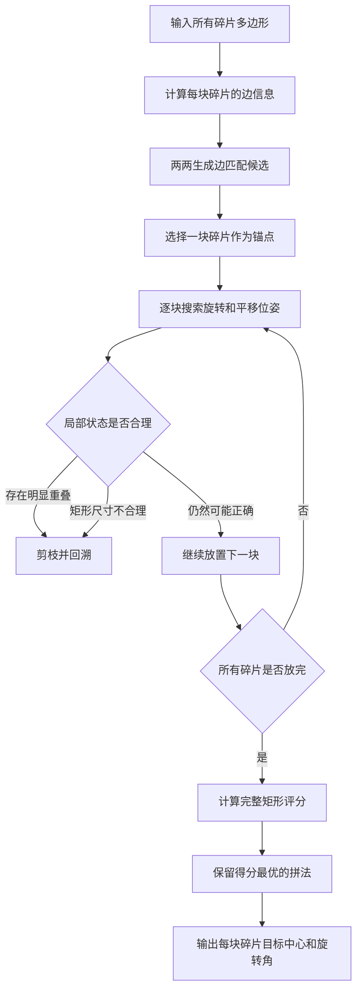

# 矩形碎片还原算法说明

> 本文档只说明碎片识别完成之后，程序如何根据各碎片的多边形轮廓，将它们重新拼接成完整矩形。

[TOC]

---

## 1. 矩形还原问题

已知若干碎片均由同一张矩形纸片裁剪得到。

程序已经获得每块碎片的：

- 多边形顶点；
- 每条边的长度；
- 碎片面积；
- 面积中心；
- 原始位置；
- 可选的表面纹理。

矩形还原需要计算每块碎片的：

- 目标位置；
- 旋转角度；
- 与其他碎片的拼接关系。

整个过程只允许：

```text
旋转
平移
```

不允许：

```text
缩放
镜像
形变
```

因此每块碎片的目标位姿可表示为：

\[
p_{\text{target}}=p_{\text{source}}R+t
\]

其中：

- \(R\) 为二维旋转矩阵；
- \(t\) 为二维平移向量。

---

## 2. 整体算法

矩形还原的核心不是找到一对长度相等的边后立即拼接，而是：

> **先根据边关系生成大量合理候选，再通过组合搜索寻找完整拼法，最后使用矩形填充率、空缺面积和重叠面积判断结果是否正确。**

整体流程如下：



算法可以概括为：

```text
边匹配候选生成
+
深度优先组合搜索
+
重叠和尺寸剪枝
+
完整矩形全局评分
```

---

# 3. 碎片几何模型

假设第 \(i\) 块碎片的多边形为：

\[
P_i=\{p_{i1},p_{i2},\ldots,p_{in}\}
\]

其中每个顶点为：

\[
p_{ij}=(x_{ij},y_{ij})
\]

相邻两个顶点构成一条边：

\[
e_{ij}=(p_{ij},p_{i,j+1})
\]

边向量为：

\[
\vec{v}_{ij}=p_{i,j+1}-p_{ij}
\]

边长为：

\[
L_{ij}=\left\|\vec{v}_{ij}\right\|
\]

单位方向向量为：

\[
\hat{v}_{ij}
=
\frac{\vec{v}_{ij}}
{\left\|\vec{v}_{ij}\right\|}
\]

每块碎片需要保存：

| 几何数据 | 用途 |
|---|---|
| 多边形顶点 | 旋转、平移和外接矩形计算 |
| 每条边长度 | 寻找可能拼接边 |
| 每条边方向 | 计算对接旋转角 |
| 碎片面积 | 计算矩形填充率 |
| 面积中心 | 输出抓取点和放置点 |
| 原始纹理 | 花纹碎片接缝验证 |

---

# 4. 边匹配候选生成

## 4.1 为什么不能直接贪心拼接

假设有三条长度相近的边：

```text
碎片A边1 = 38.2 mm
碎片B边2 = 38.7 mm
碎片C边3 = 37.9 mm
```

仅根据边长无法判断A应该与B还是C拼接。

因此程序不会立即确定拼接关系，而是把所有可能关系保存为候选：

```text
候选1：A边1 与 B边2
候选2：A边1 与 C边3
```

之后由完整矩形的全局形状决定哪一种才是正确拼法。

---

## 4.2 完整边匹配

对于任意两块碎片的任意两条边，设边长为：

\[
L_1,L_2
\]

当满足：

\[
|L_1-L_2|
\leq
\max
\left(
4\text{ mm},
0.1\min(L_1,L_2)
\right)
\]

时，将两条边视为可能的完整拼接边。

该条件同时允许：

- 最大约4 mm的固定误差；
- 最大约10%的相对误差。

这样可以容忍轮廓识别和透视校正造成的小误差。

---

## 4.3 边方向反向对齐

正确拼接时，两块碎片的接触边方向应当相反。

设已放置碎片的边方向为：

\[
\hat{v}_a
\]

待放置碎片的边方向为：

\[
\hat{v}_b
\]

程序需要求旋转矩阵 \(R\)，使：

\[
R\hat{v}_b=-\hat{v}_a
\]

旋转角可通过两个向量夹角计算：

\[
\theta
=
\operatorname{atan2}
\left(
\hat{v}_b\times(-\hat{v}_a),
\hat{v}_b\cdot(-\hat{v}_a)
\right)
\]

旋转后，再通过平移使两条边的端点或中点重合。

---

## 4.4 平移计算

设已放置边端点为：

\[
a_1,a_2
\]

待放置边旋转后的端点为：

\[
b_1',b_2'
\]

由于两条边方向相反，可以使用：

\[
b_1'\rightarrow a_2
\]

\[
b_2'\rightarrow a_1
\]

求平移向量：

\[
t=a_2-b_1'
\]

或者使用两条边中点对齐：

\[
t=
\frac{a_1+a_2}{2}
-
\frac{b_1'+b_2'}{2}
\]

最终得到待放置碎片的一个候选位姿：

\[
T=(R,t)
\]

---

## 4.5 部分边匹配

实际裁剪中可能出现：

```text
一条长边与两条短边拼接
```

例如：

```text
40 mm长边
=
20 mm短边
+
20 mm短边
```

因此程序还允许：

- 短边与长边左端对齐；
- 短边与长边右端对齐；
- 一长边连接多条短边；
- T形连接。

为了防止产生大量错误候选，长边剩余的未匹配部分需要达到一定长度，例如：

```text
剩余长度大于约18 mm
```

程序通常先搜索完整边匹配，只有无法得到合格结果时，才启用部分边匹配。

---

# 5. 锚点选择

矩形还原开始时，需要固定一块碎片作为锚点。

锚点的旋转和平移设为：

\[
R=I
\]

\[
t=(0,0)
\]

其他碎片均相对于锚点进行放置。

程序不一定选择面积最大的碎片，而更适合选择：

> 与其他碎片产生的边匹配候选最少的碎片。

原因是：

- 形状特殊的碎片匹配歧义更小；
- 第一层搜索分支更少；
- 能够明显降低组合搜索量；
- 更容易优先找到正确拼法。

如果当前锚点搜索失败，程序还可以更换其他碎片作为锚点重新搜索。

---

# 6. 深度优先组合搜索

## 6.1 搜索状态

每个搜索状态包含：

```text
已经放置的碎片
尚未放置的碎片
每块碎片的旋转矩阵
每块碎片的平移向量
当前外接矩形
当前重叠面积
当前候选评分
```

---

## 6.2 搜索过程

假设有四块碎片A、B、C、D。

搜索过程为：

```text
1. 固定A作为锚点
2. 尝试将B的一条边与A的一条边对齐
3. 检查A和B是否发生明显重叠
4. 尝试将C连接到A或B
5. 检查当前外接矩形是否仍然合理
6. 尝试将D连接到A、B或C
7. 四块都放置完成后进行全局评分
8. 回溯并尝试其他拼接关系
```

---

## 6.3 搜索伪代码

```python
def search(placed, unplaced):
    if not unplaced:
        score = evaluate_rectangle(placed)
        save_solution_if_better(placed, score)
        return

    next_piece = choose_next_piece(unplaced)

    for placed_piece in placed:
        candidates = get_edge_match_candidates(
            placed_piece,
            next_piece
        )

        for candidate in candidates:
            pose = calculate_pose(candidate)

            if has_invalid_overlap(
                next_piece,
                pose,
                placed
            ):
                continue

            if bounding_rectangle_too_large(
                next_piece,
                pose,
                placed
            ):
                continue

            if impossible_to_form_rectangle(
                next_piece,
                pose,
                placed
            ):
                continue

            search(
                placed + [(next_piece, pose)],
                unplaced - {next_piece}
            )
```

---

# 7. 搜索顺序优化

## 7.1 优先放置候选最少的碎片

在尚未放置的碎片中，优先选择：

```text
可匹配边数量最少
```

的碎片。

这类似于约束满足问题中的“最少剩余值”策略。

候选越少，越适合优先确定，从而减少错误路径。

---

## 7.2 优先尝试高质量边匹配

候选边按照以下信息排序：

1. 边长误差；
2. 两端内角误差；
3. 边方向误差；
4. 对齐后重叠面积；
5. 花纹连续性；
6. 是否为完整边匹配。

较好的候选先搜索，可以更早得到高质量完整解，并利用当前最优解对后续分支进行剪枝。

---

# 8. 搜索剪枝

组合搜索的分支数量可能非常大，因此必须提前删除不可能形成矩形的状态。

---

## 8.1 重叠剪枝

若新碎片与已有碎片出现大面积重叠，则该候选一定错误。

对于凸多边形，可以使用：

```python
intersection_area, _ = cv2.intersectConvexConvex(
    polygon_a,
    polygon_b
)
```

计算交集面积。

设两块碎片交叠面积为：

\[
A_{ij}^{\text{overlap}}
\]

若：

\[
A_{ij}^{\text{overlap}}>A_{\max}
\]

则立即回溯。

应保留很小的重叠容差，以容忍轮廓拟合误差。

---

## 8.2 外接矩形尺寸剪枝

将当前所有已放置碎片的顶点合并：

\[
P_{\text{all}}
=
\bigcup_iP_i
\]

计算最小面积外接矩形：

```python
rect = cv2.minAreaRect(all_points)
```

设外接矩形长边和短边为：

\[
W,H
\]

如果当前尺寸已经超过允许范围，再加入碎片只会使矩形更大，因此可以直接剪枝。

例如目标范围为：

```text
长边：90～120 mm
短边：50～90 mm
```

搜索阶段可以增加少量容差。

---

## 8.3 最大可能填充率剪枝

设所有碎片总面积为：

\[
A_s=\sum_iA_i
\]

当前外接矩形面积为：

\[
A_r=W\times H
\]

若最低允许填充率为：

\[
F_{\min}
\]

而当前满足：

\[
A_r>\frac{A_s}{F_{\min}}
\]

则说明即使剩余碎片全部放入，最终也不可能达到要求。

例如：

\[
F_{\min}=0.72
\]

则当：

\[
A_r>\frac{A_s}{0.72}
\]

时，该状态可以直接删除。

---

## 8.4 状态去重

不同的边匹配顺序可能得到近似相同的最终位姿。

例如：

```text
先放B再放C
```

和：

```text
先放C再放B
```

可能得到相同布局。

程序将每块碎片的位姿进行量化，例如：

```text
中心位置量化到约1 mm
旋转角量化到约2°
```

然后生成状态哈希。

若相同状态已经搜索过，则不再重复展开。

---

## 8.5 搜索时间和节点限制

为了保证实时运行，程序通常会设置：

```text
最大搜索节点数
最大搜索时间
每对碎片最多保留的匹配候选数
最多保留的完整解数量
```

例如：

```text
搜索节点上限：约7000
主要搜索时间：约1.35秒
每对碎片最多保留：约40个候选
最多保留：约36个完整解
```

因此该算法不是无限制暴力穷举，而是：

> **有限时间内的启发式组合搜索。**

---

# 9. 完整拼法的矩形评分

所有碎片放置完成后，不能仅根据接触边是否重合判断正确性。

程序需要判断整个结果是否真正构成一个矩形。

主要检查：

```text
矩形外框
填充率
空缺面积
重叠面积
尺寸范围
整体连通性
```

---

## 9.1 最小面积外接矩形

将全部碎片顶点合并后，计算最小面积外接矩形。

设矩形宽、高为：

\[
W,H
\]

矩形面积为：

\[
A_r=W\times H
\]

---

## 9.2 碎片总面积

所有碎片面积之和为：

\[
A_s=\sum_iA_i
\]

如果没有重叠，且刚好组成矩形，则应满足：

\[
A_s\approx A_r
\]

---

## 9.3 重叠面积

对所有碎片两两计算交集面积：

\[
A_o=
\sum_{i<j}
\operatorname{Area}(P_i\cap P_j)
\]

重叠越大，说明拼接结果越不合理。

考虑重叠后，有效并集面积可近似为：

\[
A_u=A_s-A_o
\]

---

## 9.4 空缺面积

矩形内部没有被碎片覆盖的面积为：

\[
A_g=\max(0,A_r-A_u)
\]

正确拼接应满足：

\[
A_g\approx0
\]

---

## 9.5 超出面积

若碎片有效面积大于外接矩形面积，则定义：

\[
A_e=\max(0,A_u-A_r)
\]

通常表示：

- 存在较大重叠；
- 外接矩形方向不合理；
- 碎片位置错误。

---

## 9.6 填充率

填充率可以定义为：

\[
F=\frac{A_u}{A_r}
\]

正确拼接时：

\[
F\rightarrow1
\]

填充率低通常说明：

- 矩形内部存在空洞；
- 碎片之间距离过大；
- 拼接边选择错误；
- 外接矩形面积过大。

---

## 9.7 几何综合评分

一种综合评分形式为：

\[
S_g=
100
\frac{
A_g+A_e+2A_o
}{
A_r
}
+
1.5P_d
\]

其中：

- \(A_g\)：空缺面积；
- \(A_e\)：超出面积；
- \(A_o\)：重叠面积；
- \(P_d\)：矩形尺寸偏差惩罚。

重叠面积乘以2，是因为重叠不仅占据错误位置，还通常会导致矩形其他区域产生空缺。

评分越小，拼法越好。

---

# 10. 矩形硬验证

仅使用综合分数仍可能把错误结果判断为成功。

因此最终结果还应通过以下硬条件：

## 10.1 填充率验证

\[
F\geq F_{\text{required}}
\]

例如：

```text
填充率至少达到0.90或更高
```

---

## 10.2 重叠验证

\[
A_o\leq A_{\text{overlap max}}
\]

只允许由轮廓误差造成的少量重叠。

---

## 10.3 空缺验证

\[
A_g\leq A_{\text{gap max}}
\]

防止多个碎片只是在外框上接近矩形，但内部存在明显孔洞。

---

## 10.4 尺寸验证

矩形长宽必须位于合理范围：

\[
W_{\min}\leq W\leq W_{\max}
\]

\[
H_{\min}\leq H\leq H_{\max}
\]

---

## 10.5 连通性验证

所有碎片应组成一个连通整体。

若某块碎片与其他碎片完全没有接触，即使外接矩形填充率勉强合格，也不应判定为正确。

可以建立碎片邻接图：

```text
碎片作为节点
有效接触关系作为边
```

最终要求邻接图只有一个连通分量。

---

## 10.6 边界矩形验证

完整拼图外边界应主要分布在四条矩形边附近。

可以计算所有外边界点到矩形四条边的最小距离：

\[
d(p)=\min(d_1,d_2,d_3,d_4)
\]

若大量外边界点远离矩形边，则说明外轮廓不是标准矩形。

---

# 11. 花纹碎片的接缝验证

对于几何形状相似的碎片，仅使用边长可能产生多个近似解。

花纹模式会额外计算接缝两侧的纹理连续性。

---

## 11.1 接缝采样

在候选拼接边上均匀选取若干点。

对每个采样点，在接缝两侧分别偏移约：

```text
1.5 mm
```

读取两块碎片上的颜色或纹理。

---

## 11.2 LAB颜色距离

将颜色转换到LAB空间。

接缝两侧颜色差异为：

\[
\Delta E
=
\left\|
Lab_1-Lab_2
\right\|
\]

正确拼接时：

- 线条通常连续；
- 颜色变化通常连续；
- 图案方向通常一致；
- \(\Delta E\) 通常较小。

---

## 11.3 抗反光处理

为了降低高光、阴影和边缘黑线影响，可以：

```text
删除颜色差异最大的15%采样点
再计算其余采样点的平均值
```

纹理评分为：

\[
S_t=
\frac{1}{N}
\sum_{k=1}^{N}\Delta E_k
\]

---

## 11.4 几何和纹理联合评分

最终评分可表示为：

\[
S_{\text{total}}
=
S_g
+
w_tS_t
\]

例如：

\[
w_t=0.3
\]

几何评分仍然是主要依据，纹理用于在多个几何近似解中选择正确结果。

---

# 12. 固定四片模板还原

如果碎片形状固定且已知，可以不使用通用组合搜索，而采用模板匹配。

固定四片模式的核心为：

```text
标准模板
+
刚体轮廓匹配
+
四片全排列
```

---

## 12.1 标准模板

程序预先保存四块标准碎片在完整矩形中的目标轮廓。

对于每块实测碎片，分别与四块模板进行对齐。

---

## 12.2 刚体轮廓匹配

只允许旋转和平移：

\[
p'=pR+t
\]

通过SVD求最优刚体对齐，使轮廓均方根误差最小。

如果轮廓顶点数量不同，可以沿周长均匀采样相同数量的点后再对齐。

---

## 12.3 匹配代价

实测碎片 \(i\) 与模板 \(j\) 的代价可表示为：

\[
C_{ij}
=
E_{\text{shape}}
+
w_aE_{\text{area}}
+
w_nE_{\text{vertex}}
\]

其中：

- \(E_{\text{shape}}\)：轮廓对齐误差；
- \(E_{\text{area}}\)：面积比例误差；
- \(E_{\text{vertex}}\)：顶点数量差异。

---

## 12.4 四片排列

四块实测碎片与四块模板共有：

\[
4!=24
\]

种分配方式。

程序遍历全部24种排列，选择：

\[
C_{\text{total}}
=
\sum_iC_{i,\pi(i)}
\]

最小的分配方式。

固定模板模式速度快、稳定性高，但只能处理预先已知的固定碎片。

---

# 13. 目标位姿输出

搜索得到的是每块碎片相对于临时锚点坐标系的位姿。

还需要将完整矩形整体旋转和平移到最终放置区域。

设完整拼图的整体变换为：

\[
T_g=(R_g,t_g)
\]

第 \(i\) 块碎片在搜索中的变换为：

\[
T_i=(R_i,t_i)
\]

最终变换为：

\[
R_i^{\text{final}}=R_gR_i
\]

\[
t_i^{\text{final}}=R_gt_i+t_g
\]

---

## 13.1 目标面积中心

设碎片原始面积中心为：

\[
c_i
\]

则目标面积中心为：

\[
c_i^{\text{target}}
=
R_i^{\text{final}}c_i
+
t_i^{\text{final}}
\]

---

## 13.2 旋转角

由最终旋转矩阵得到旋转角：

\[
\theta_i
=
\operatorname{atan2}
\left(
R_{21},
R_{11}
\right)
\]

转换为角度：

\[
\theta_i^{\circ}
=
\theta_i
\frac{180}{\pi}
\]

按照当前项目坐标约定：

```text
标定框右下角为原点
向上为x轴正方向
向左为y轴正方向
逆时针旋转为负
顺时针旋转为正
```

因此程序输出前需要将OpenCV角度转换为机械臂所使用的角度符号。

---

## 13.3 输出格式

```text
碎片ID：1
初始面积中心：(x1, y1)
目标面积中心：(x2, y2)
旋转角度：-35.2°
```

机械臂可按照以下流程执行：

```text
移动到初始面积中心
吸取碎片
抬起碎片
旋转指定角度
移动到目标面积中心
放下碎片
```

---

# 14. 算法容易出现的问题

## 14.1 多条边长度接近

当多个碎片具有相近边长时，会产生大量候选。

解决方法：

- 增加边两端内角特征；
- 增加纹理连续性；
- 加强矩形硬验证；
- 增加搜索预算；
- 优化候选排序。

---

## 14.2 正确候选被截断

如果每对碎片只保留固定数量候选，正确候选可能排在后面而被删除。

解决方法：

- 动态调整候选数量；
- 不只按照边长误差排序；
- 对具有特殊角度特征的候选给予更高优先级。

---

## 14.3 错误拼法也能得到较高填充率

仅使用总面积与外接矩形面积之比，有时无法识别局部重叠和内部孔洞。

解决方法：

- 单独计算真实重叠面积；
- 单独计算矩形内部空缺；
- 进行连通性验证；
- 检查外边界与矩形四边的一致性。

---

## 14.4 搜索时间过长

部分边匹配和相似边会导致搜索分支爆炸。

解决方法：

- 先完整边搜索，再部分边搜索；
- 选择候选最少的碎片作为锚点；
- 优先放置候选最少的碎片；
- 使用状态哈希去重；
- 使用填充率上界提前剪枝；
- 发现高质量完整解后收紧剪枝条件。

---

# 15. 推荐的矩形还原策略

对于当前赛题，建议使用以下顺序：

```text
第一步：生成完整边匹配候选
第二步：使用DFS搜索完整边拼法
第三步：进行矩形填充率、重叠和空缺硬验证
第四步：若失败，再启用部分边匹配
第五步：若有花纹，加入接缝纹理连续性
第六步：更换锚点重新搜索
第七步：选择综合评分最低且通过全部硬验证的方案
```

---

# 16. 核心总结

矩形还原可以分成三个层次。

## 16.1 局部几何层

利用：

```text
边长
边方向
边端点
内角
部分边关系
```

生成碎片之间的可能拼接位姿。

---

## 16.2 组合搜索层

通过：

```text
锚点固定
深度优先搜索
重叠剪枝
尺寸剪枝
填充率剪枝
状态去重
```

组合出所有可能的完整拼法。

---

## 16.3 全局验证层

通过：

```text
矩形外接框
填充率
内部空缺
碎片重叠
矩形尺寸
整体连通性
纹理连续性
```

判断完整拼法是否正确。

因此整个矩形还原算法的核心可以总结为：

> **局部边匹配负责生成可能的拼接方式，组合搜索负责构造完整布局，全局矩形验证负责选择最终正确结果。**

不能只根据一对边是否等长就确定拼接关系，而必须判断所有碎片组合完成后，是否真正形成一个低重叠、低空缺、高填充率的矩形。
